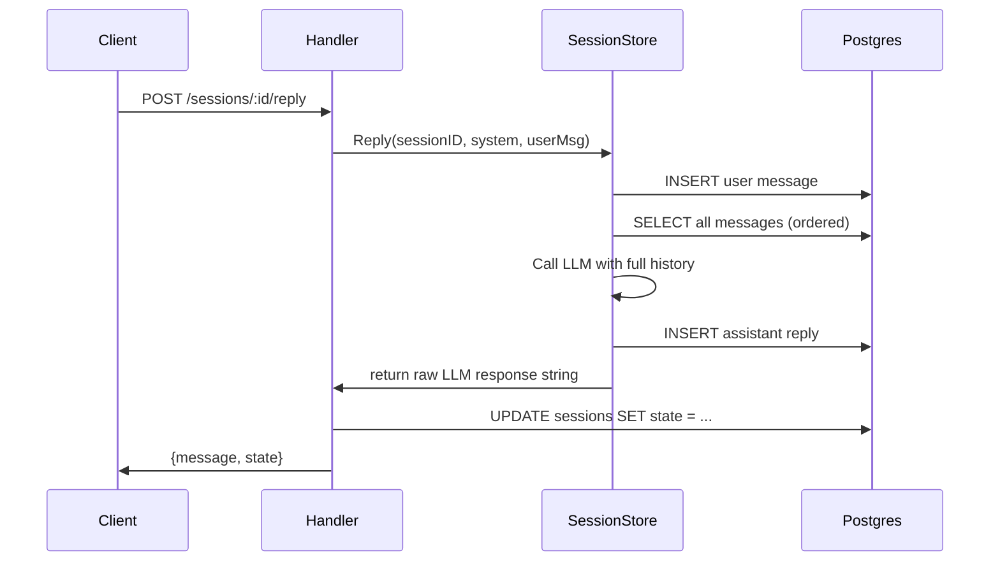

# ADR 001: PostgreSQL for Session Storage

**Status:** Accepted

## Context

Each interview is a session that accumulates state across multiple HTTP requests: the problem text, the current interview stage, and the full message history. This data needs to be accessible on every request.

## Decision

Use PostgreSQL as the single persistence layer for sessions and messages, with `database/sql` and `lib/pq`.

## Alternatives Considered

| Option | Why rejected |
|--------|-------------|
| In-memory map (Go struct) | Lost on server restart; can't scale to multiple processes |
| Redis | Extra infrastructure dependency; no relational joins for ordered message history |
| SQLite | Simpler setup, but file-locking issues under concurrent writes |

## Data Model

```
sessions                          messages
─────────────────────────         ──────────────────────────────────
id          UUID  PK              id           SERIAL PK
state       TEXT                  session_id   UUID  FK → sessions.id
problem_text TEXT                 role         TEXT  (user | assistant)
created_at  TIMESTAMPTZ           content      TEXT
                                  created_at   TIMESTAMPTZ
```

Messages are ordered by `(created_at, id)` to reconstruct conversation history in the correct sequence for every LLM call.

## Request Flow



## Consequences

- Migrations run automatically at startup via `db.Migrate()` (golang-migrate, embedded SQL).
- `db.Seed()` is idempotent — safe to run on every restart.
- Full message history is fetched on every `Reply` call. This is fine at interview scale (tens of messages) but would need pagination at larger volumes.