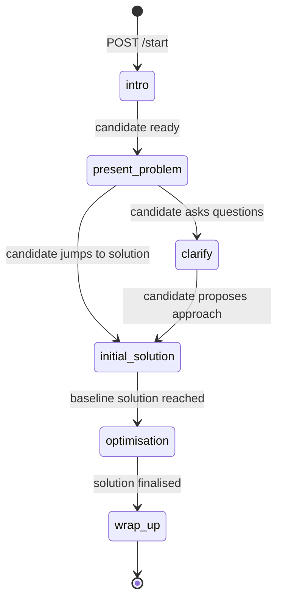
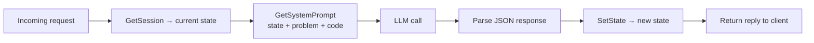

# ADR 002: State Machine for Interview Flow

**Status:** Accepted

## Context

A coding interview has a natural structure — introductions, problem presentation, clarification, solution discussion, optimisation, wrap-up. Without explicit structure, a freeform LLM conversation tends to drift: the AI might jump to the solution too early, skip complexity analysis, or never wrap up cleanly.

## Decision

Model the interview as an explicit state machine with six states. The current state is persisted in the `sessions` table and sent to the LLM on every turn as part of the system prompt.

## States and Transitions



## How the LLM Advances State

The LLM is instructed to return JSON on every turn:

```json
{"reply": "...", "current_state": "present_problem"}
```

`ReplyHandler` parses `current_state` and calls `store.SetState` to persist it. The system prompt for the next turn is then rebuilt using the new state, giving the LLM its updated instructions and valid next transitions.



## Alternatives Considered

| Option | Why rejected |
|--------|-------------|
| Freeform prompt only | LLM drifts without structure; no way to track progress |
| Numbered stages without DB state | State lost between requests; no state-specific prompting |
| Client-side state only | Backend can't enforce interview structure; state lost on page refresh |

## State-Specific Prompting

Each state has its own section in `internal/prompts/system.go` that tells the LLM what to do and which states it may transition to next. This keeps the LLM focused — it never sees all six state descriptions at once, only the current state and its valid successors.

## Consequences

- Adding a new state requires: a new constant in `session.go`, entries in `stateInstructions` and `statePrompts` in `system.go`, and updating the adjacent state prompts to include the new transition.
- The LLM can return any string as `current_state` — there is currently no validation that the value matches a known state constant. Invalid values are stored verbatim.