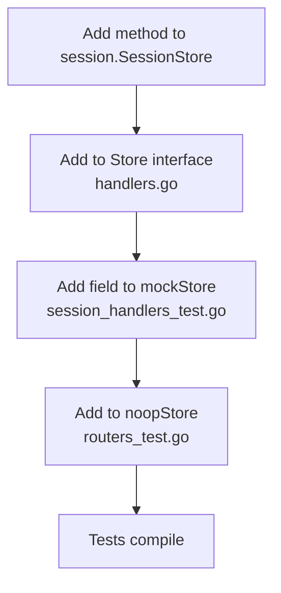

# ADR 003: Store Interface for Handler Testability

**Status:** Accepted

## Context

The HTTP handlers in `internal/api` orchestrate database reads, LLM calls, and state updates. Testing them against a real PostgreSQL database and a live Anthropic API would make tests slow, flaky, and require external setup.

## Decision

Define a `Store` interface in `internal/api/handlers.go` that is the exact subset of `*session.SessionStore` the handlers need. Tests inject a `mockStore` with per-field injectable functions.

```
internal/api/handlers.go          internal/api/session_handlers_test.go
─────────────────────────         ─────────────────────────────────────
type Store interface {             type mockStore struct {
  GetRandomProblemText(...)          problemFn func(...) (string, error)
  CreateSession(...)                 createFn  func(...) (*Session, error)
  UpdateChatHistory(...)             updateFn  func(...) error
  GetSession(...)                    getFn     func(...) (*Session, error)
  Reply(...)                         replyFn   func(...) (string, error)
  SetState(...)                      stateFn   func(...) error
  GenerateReview(...)                reviewFn  func(...) (string, error)
}                                  }
```

## Alternatives Considered

| Option | Why rejected |
|--------|-------------|
| Integration tests with real DB | Requires a running Postgres and seeded data; slow and fragile in CI |
| `sqlmock` library | Couples tests to SQL queries; fragile when queries change |
| Build tags to swap implementations | More complex; doesn't isolate individual method failures cleanly |

## How It Works

Each test case controls exactly which methods fail and what they return:

```go
// Only CreateSession fails — everything else is untested
store := &mockStore{
    problemFn: func(...) (string, error) { return "problem", nil },
    createFn:  func(...) (*session.Session, error) {
        return nil, errors.New("db error")
    },
}
```

`successStore()` is a helper that returns a fully-working mock for the happy-path case.

## Extending the Interface

When adding a new method to `session.SessionStore` and calling it from a handler:



Missing any step causes a compile error — the compiler enforces completeness.

## Consequences

- Handler tests run without any external dependencies.
- `noopStore` in `routers_test.go` exists purely for route registration tests that only check status codes, not business logic.
- The interface lives in the `api` package (not `session`), so `session` does not import `api` — no circular dependency.