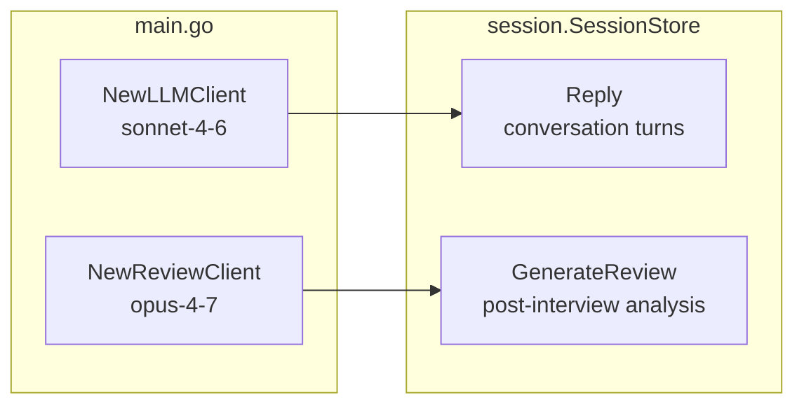

# ADR 004: Separate LLM Clients for Interview and Review

**Status:** Accepted

## Context

LeetCoach uses the LLM in two fundamentally different ways:

1. **Interview replies** — real-time, conversational, must be fast. One short response per user message.
2. **End-of-session review** — runs once after the interview, analyses the full transcript, and produces a detailed multi-paragraph evaluation across five dimensions.

These use cases have different latency tolerances, cost profiles, and quality requirements.

## Decision

Define two separate interfaces and instantiate two separate Anthropic clients with different models:

```
llm.Client        → LLM_MODEL=claude-sonnet-4-6     (interview replies)
llm.ReviewClient  → REASONING_MODEL=claude-opus-4-7  (end-of-session review)
```



## Interface Split

```go
type Client interface {
    Send(ctx, system string, messages []Message) (string, error)
}

type ReviewClient interface {
    SendReview(ctx, system string, messages []Message) (string, error)
}
```

Although the signatures are identical today, keeping them separate means the review client can diverge — for example, enabling extended thinking, streaming, or a different timeout — without affecting the interview path.

## Alternatives Considered

| Option | Why rejected |
|--------|-------------|
| Single client, same model for everything | Review quality suffers on a smaller model; can't tune independently |
| Single interface, model selected at call site | Logic leaks into the session layer; harder to swap providers |
| Runtime model selection via parameter | Adds complexity; callers shouldn't need to know which model to use |

## Consequences

- Model names are configured via `.env` (`LLM_MODEL`, `REASONING_MODEL`), so swapping models requires no code change.
- Both clients are currently Anthropic implementations. Adding a new provider means implementing both interfaces and updating the switch in `main.go`.
- `claude-opus-4-7` (review) is significantly more expensive per token than `claude-sonnet-4-6` (replies). Review is called at most once per session, so cost impact is bounded.