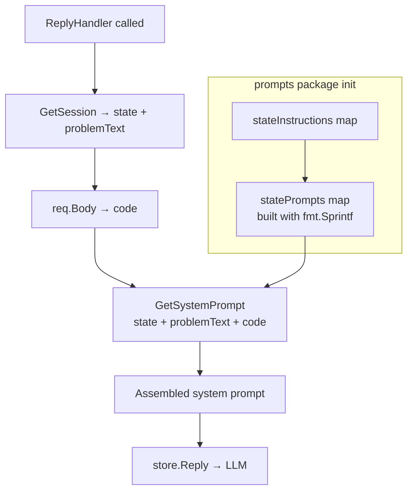

# ADR 005: System Prompt Reconstructed Per Turn

**Status:** Accepted

## Context

The LLM needs three pieces of context on every turn:
1. Its role and JSON response format (fixed)
2. The current interview state and valid transitions (changes as interview progresses)
3. The candidate's current code (changes every time the user types)

The question is how to assemble these and when.

## Decision

Reconstruct the full system prompt from scratch on every `ReplyHandler` call using `prompts.GetSystemPrompt(state, problemText, code)`.

```
GetSystemPrompt(state, problemText, code)
│
├── baseInstructions (fixed string with %s placeholder for problemText)
│   └── filled with problemText via fmt.Sprintf
│
├── statePrompts[state] (pre-built at package init, includes valid transitions)
│
└── candidate code block (appended only if code != "")
```



## Why Not Store the System Prompt in the Database?

| Approach | Problem |
|----------|---------|
| Store in DB | Code changes every keystroke — would require a write before every LLM call |
| Store per-state prompt only | Problem text and code still need injecting at call time anyway |
| Rebuild each turn (chosen) | Always correct; no synchronisation needed; stateless function |

## statePrompts Initialisation Order

`statePrompts` uses `fmt.Sprintf` in a `var` declaration that references `stateInstructions`. Go initialises package-level vars in declaration order within a file, so **`stateInstructions` must be declared before `statePrompts` in `system.go`**. Reordering them causes a runtime panic (empty strings, not a compile error).

## Code Is Not Stored in the Database

The `replyRequest` body carries `message` (stored in `messages` table as conversation history) and `code` (appended to the system prompt, never written to DB). This keeps the DB lean and avoids the need to version or truncate code snapshots.

## Consequences

- The system prompt is re-evaluated on every turn, so changing `stateInstructions` text takes effect immediately for in-progress sessions.
- If the LLM ignores the JSON format instruction and returns free text, `ReplyHandler` returns 500 with no retry. There is no fallback prompt or structured output enforcement.
- `code` is visible to the LLM but the candidate sees no indication their code is being read — this is intentional (mirrors a real screenshare interview).