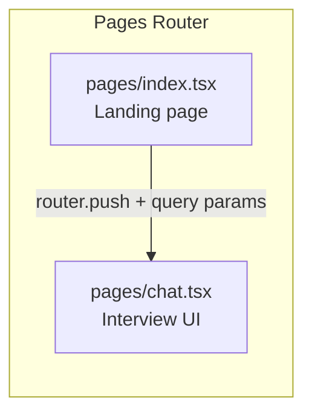

# ADR 001: Next.js with Pages Router

**Status:** Accepted

## Context

The frontend needs two views: a landing page and a chat/interview page. We needed to choose a React framework and, within Next.js, whether to use the newer App Router or the stable Pages Router.

## Decision

Use **Next.js with the Pages Router** (`src/pages/`).

## Alternatives Considered

| Option | Why rejected |
|--------|-------------|
| Plain React SPA (Vite/CRA) | No built-in routing; more manual setup |
| Next.js App Router | Server Components add complexity that isn't needed — all state is client-side |
| Remix | Unfamiliar; overkill for two pages |

## Why Pages Router over App Router

The App Router's primary benefit is React Server Components — rendering on the server and streaming HTML. LeetCoach's chat page is entirely interactive and client-driven (live typing, state updates, WebSocket-style polling). There are no server-rendered data fetches that would benefit from RSC.

The Pages Router gives a simpler mental model for this use case:



`useRouter()` from `next/router` makes reading query params (`sessionID`, `initialText`) straightforward with no async overhead.

## Route Structure

```
/          → pages/index.tsx   Landing page, start interview button
/chat      → pages/chat.tsx    Interview UI (requires ?sessionID=... query param)
```

## Consequences

- All state management is client-side via `useState`/`useRef` — no server actions or server components.
- `next/router` (Pages Router) is used throughout, not `next/navigation` (App Router). Don't mix them.
- The `src/app/` folder exists but only contains `layout.tsx` and `globals.css` left over from scaffolding — the actual app lives in `src/pages/`.