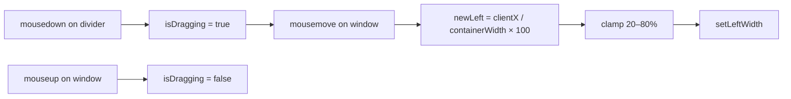

# ADR 002: Split-Pane Layout with Draggable Divider

**Status:** Accepted

## Context

During the interview the candidate needs to write code and chat with the AI interviewer simultaneously. These are two distinct surfaces that are both active throughout the session.

## Decision

Use a horizontally split pane: code editor on the left, chat interface on the right, with a draggable divider so the candidate can resize to their preference.

```
┌──────────────────────────────────────────────────────────┐
│  Header                                                   │
├───────────────────────┬─┬────────────────────────────────┤
│                       │ │  [Interviewer]: Here is the... │
│  // code editor       │◄►│  [You]: I would use a hashmap │
│  function twoSum() {  │ │  [Interviewer]: Good, what is  │
│    ...                │ │  ...                           │
│  }                    │ │                                │
│                       │ ├────────────────────────────────┤
│                       │ │  [type your message...]  Send  │
└───────────────────────┴─┴────────────────────────────────┘
         left pane      ^ right pane
                      divider
```

## Alternatives Considered

| Option | Why rejected |
|--------|-------------|
| Tabbed layout (code / chat tabs) | Candidate can't see chat while coding; loses interview flow |
| Separate pages | Would require navigation interruptions mid-interview |
| Stacked vertically | Less space-efficient on landscape screens; not how real interview tools work |
| Fixed 50/50 split | Candidate can't optimise for their screen size or preference |

## Implementation

The divider is implemented with mouse event listeners on `window`. The split ratio is stored as a percentage (`leftWidth` state, default 50%) so it responds to window resize correctly.



The dragging state is a `useRef` (not `useState`) to avoid re-renders during mouse movement — only the final `setLeftWidth` triggers a render.

## Consequences

- Minimum/maximum widths are clamped at 20%/80% to prevent either pane from becoming unusably small.
- The code editor content (`code` state) is sent with every reply to the backend so the LLM always sees the candidate's latest code.
- `mousemove` and `mouseup` listeners are attached to `window` (not the divider element) so dragging continues even if the cursor leaves the divider during fast movement.