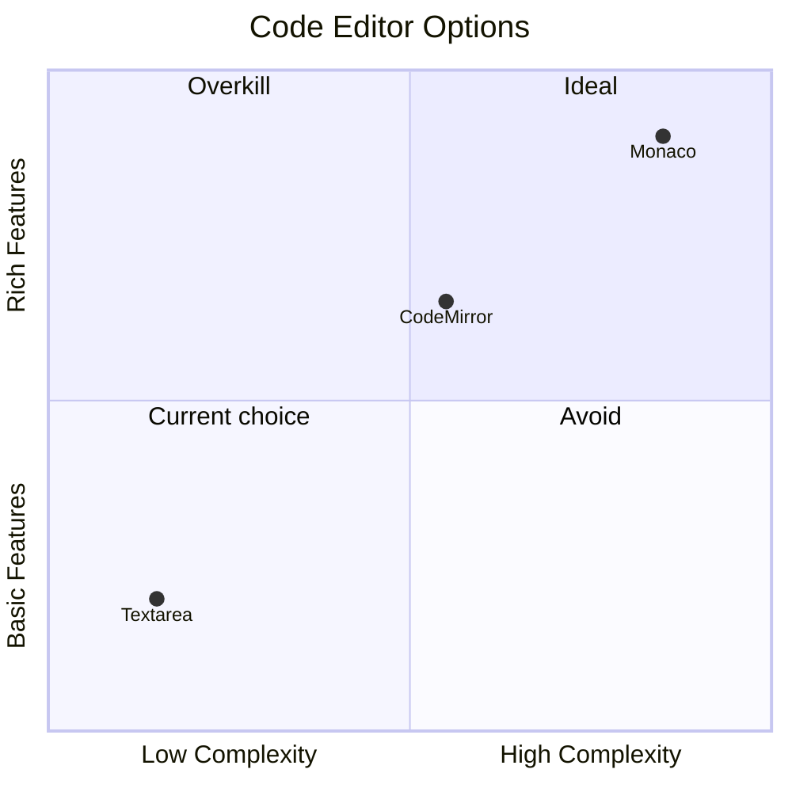

# ADR 004: Plain Textarea as Code Editor

**Status:** Accepted

## Context

The interview UI needs a surface where the candidate can write code. The quality of this editor affects how natural the experience feels.

## Decision

Use a native HTML `<textarea>` styled to look like a code editor (monospace font, light background, no spell-check).

## Alternatives Considered

| Option | Bundle size | Complexity | Why rejected |
|--------|-------------|------------|-------------|
| Monaco Editor (VS Code engine) | ~2–4 MB | High | Significant bundle cost; requires async loading; overkill for MVP |
| CodeMirror 6 | ~300 KB | Medium | Still adds a dependency and setup for syntax highlighting, keybindings |
| Ace Editor | ~300 KB | Medium | Older API; similar trade-off to CodeMirror |
| `<textarea>` (chosen) | 0 KB | None | Zero dependencies; works immediately |

## Trade-offs

The primary purpose of the code editor is to share the candidate's code with the LLM interviewer — not to be a productive coding environment in its own right. The LLM reads the code via the system prompt; the candidate types their approach. Syntax highlighting and autocompletion are nice-to-haves, not requirements.

## What the Textarea Lacks

- Syntax highlighting
- Auto-indentation / tab key handling (Tab moves focus by default in browsers)
- Line numbers
- Autocompletion

## Consequences

- The `code` value is sent as plain text to the backend on every reply and appended to the LLM system prompt — no transformation needed regardless of editor choice.
- Upgrading to CodeMirror or Monaco later is straightforward: replace the `<textarea>` with the editor component and keep the same `value`/`onChange` props pattern. No backend changes required.
- The tab key currently moves focus out of the textarea rather than inserting indentation. This is a known UX gap.