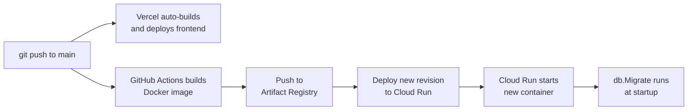

# ADR 001: Cloud Hosting Strategy

**Status:** Accepted

## Context

LeetCoach has three runtime components that each need to be hosted:

1. **Frontend** — a Next.js app (two pages, client-side data fetching, no SSR/ISR)
2. **Backend** — a Go/Gin HTTP server that calls the Anthropic API and reads/writes Postgres
3. **Database** — a PostgreSQL instance that stores sessions, messages, and problems

These components have different characteristics. The frontend is stateless and static-ish. The backend is stateless (all state lives in Postgres) and needs to scale with interview demand. The database is the only truly stateful component and needs to be persistent and durable.

## Decision

| Component | Platform | 
|-----------|----------|
| Frontend (Next.js) | Vercel |
| Backend (Go/Gin) | GCP Cloud Run |
| Database (PostgreSQL) | GCP Cloud SQL |

## How It Fits Together

```
┌─────────────────────────────────────────────────────┐
│  Browser                                             │
│  (loads from Vercel CDN)                             │
└────────────────────┬────────────────────────────────┘
                     │ HTTPS (Cloud Run URL)
┌────────────────────▼────────────────────────────────┐
│  Cloud Run — Go/Gin backend                          │
│  · Reads ANTHROPIC_API_KEY from Secret Manager       │
│  · Connects to Cloud SQL via Auth Proxy (Unix socket)│
│  · Scales to zero when idle                          │
└────────────────────┬────────────────────────────────┘
                     │ Unix socket (Cloud SQL Auth Proxy)
┌────────────────────▼────────────────────────────────┐
│  Cloud SQL — PostgreSQL 15                           │
│  · sessions, messages, problems tables               │
│  · Migrations run automatically at backend startup   │
└─────────────────────────────────────────────────────┘
```

## Why Each Platform Was Chosen

### Frontend → Vercel

Vercel has first-class Next.js support: it built Next.js and its infrastructure (CDN, edge caching, build pipeline) is designed specifically for it. Deploying Next.js elsewhere means manually replicating what Vercel does automatically.

More importantly, LeetCoach's frontend doesn't use any Vercel-specific features (no Edge Functions, no ISR, no image optimisation). This means it's easy to leave if needed — containerise it with a Dockerfile and deploy anywhere.

The practical benefit: Vercel auto-deploys on every `git push` to `main` with zero configuration. No CI pipeline needed for the frontend.

| Option | Why rejected |
|--------|-------------|
| Cloud Run (containerised Next.js) | Adds Dockerfile complexity; loses automatic Next.js build optimisations; same cost, more work |
| GCP App Engine | Less flexible than Cloud Run; Vercel is strictly better for Next.js |
| Self-managed VM | Operational overhead with no benefit at this scale |

### Backend → Cloud Run

Cloud Run runs any Docker container and handles all infrastructure concerns (load balancing, TLS, scaling). The key property for LeetCoach is **scale-to-zero**: when no one is using the app, no instances are running and cost is $0. A VM runs 24/7 regardless.

Cloud Run also integrates natively with the rest of GCP (Cloud SQL Auth Proxy, Secret Manager, Artifact Registry, IAM) which simplifies the overall setup.

| Option | Why rejected |
|--------|-------------|
| Compute Engine (VM) | Runs 24/7; requires manual OS/patching; ~$20+/month idle cost |
| Google Kubernetes Engine | Overkill for a single service; adds cluster management overhead |
| Fly.io / Railway | Good alternatives, but staying in GCP keeps the DB and backend co-located on the same network |

### Database → Cloud SQL

Cloud SQL is managed PostgreSQL: automated backups, point-in-time recovery, and no OS-level maintenance. The schema is standard SQL with no GCP-specific extensions, so migrating to any other Postgres host is a `pg_dump` / `pg_restore` away.

Keeping Cloud SQL in the same GCP region as Cloud Run avoids cross-region latency on every DB query.

| Option | Why rejected |
|--------|-------------|
| Supabase | Separate vendor; adds cross-cloud latency from Cloud Run |
| Self-managed Postgres on a VM | Requires manual backups and maintenance |
| Cloud Firestore / Spanner | Not relational; incompatible with the existing schema and `database/sql` code |

## Deployment Flow



## Consequences

- **Backend redeploys** require a Docker image rebuild and push. With GitHub Actions this is automated; manually it is `docker build → docker push → gcloud run deploy`.
- **Frontend redeploys** are fully automatic on `git push`.
- **Schema changes** are handled by golang-migrate at startup — no manual migration steps.
- **Cross-origin requests** require CORS configuration in the backend. The allowed origin must be updated when the Vercel URL changes (handled via an `ALLOWED_ORIGIN` environment variable, not hardcoded).
- **Portability:** the backend is a standard Docker container; the database is standard Postgres. Moving off GCP requires only a DSN change and a new container registry target.
